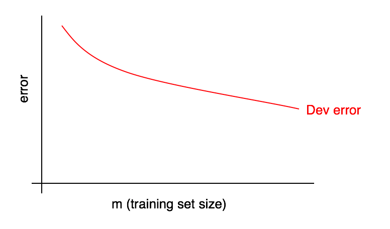
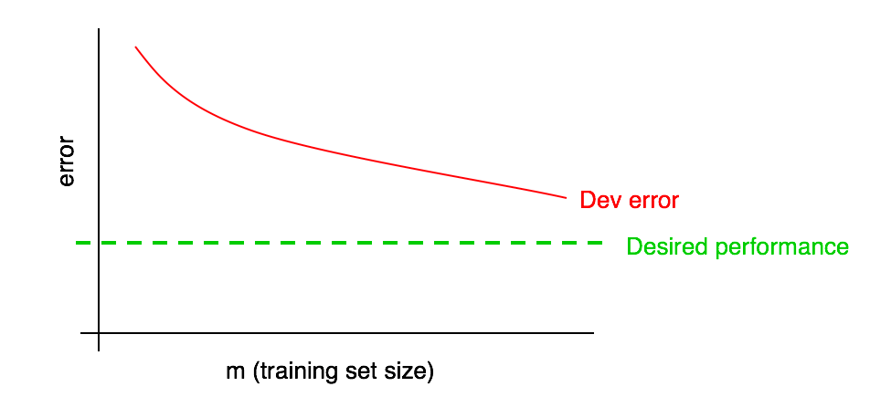
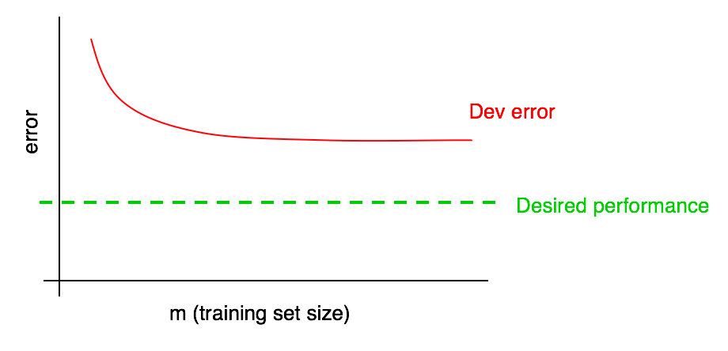

# 学习曲线
## 诊断偏差与方差：学习曲线

我们现在已经知道了一些方法，来估计可避免多少由偏差与方差所导致的误差——人们通常会估计最优错误率，以及算法在训练集和测试集上的误差。下面让我们来讨论一项更有帮助的技术：绘制学习曲线。

学习曲线可以将开发集的误差与训练集样本的数量进行关联比较。想要绘制出它，你需要设置不同大小的训练集运行算法。假设有 1000 个样本，你可以选择在规模为 100、200、300 ... 1000 的样本集中分别运行算法，接着便能得到开发集误差随训练集大小变化的曲线。下图是一个例子：

随着训练集大小的增加，开发集误差应该降低。 

我们通常会设置一些“期望错误率”，并希望学习算法最终能够达到该值。例如：

- 如果希望算法能达到人类水平的表现，那么人类错误率可能就是“期望错误率”。
- 如果学习算法为某些产品提供服务（如提供猫咪图片），我们或许将主观感受到需什么样的水平才能给用户提供出色的体验。
- 如果你已经从事一项应用很长时间，那么你可能会有一种直觉，预判在下一个季度里你会有多大的进步。 

将期望的表现水平添加到你的学习曲线中： 

显而易见，你可以根据红色的“开发误差”曲线的走势来推测，在添加一定量的数据后，曲线距离期望的性能接近了多少。在上面的例子中，将训练集的大小增加一倍可能会让你达到期望的性能，这看起来是合理的。 

因此，观察学习曲线或许能帮到你，避免了花费几个月的时间去收集两倍的训练数据，到头来却发现这并不管用的情况。 

该过程的一个缺点是，如果你只关注了开发错误曲线，当数据量变得越来越多时，将很难预测后续红色曲线的走向。因此我们会选择另外一条曲线来协助评估添加数据所带来的影响：即训练误差曲线。
