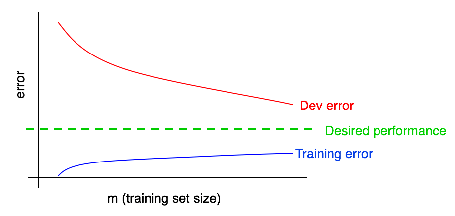

## 绘制训练误差曲线

随着训练集大小的增加，开发集（和测试集）误差应该会降低，但你的训练集误差往往会随之增加。 

让我们来举例说明一下。假设你的训练集只有两个样本：一张猫图和一张非猫图。学习算法很轻易地就可以“记住”训练集中这两个样本，并且训练集错误率为 0%. 即使有一张或两张的样本图片被误标注了，算法也能够轻松地记住它们。

现在假设你的训练集包含 100 个样本，其中有一些样本可能被误标记，或者是模棱两可的（图像非常模糊），所以即使是人类也无法分辨图中是否有一只猫。此时，或许学习算法仍然可以“记住”大部分或全部的训练集，但很难获得 100% 的准确率。通过将训练集样本数量从 2 个增加到 100 个，你会发现训练集的准确率会略有下降。

下面我们将训练误差曲线添加到原有的学习曲线中：

可以看到，蓝色的“训练误差”曲线随着训练集大小的增加而上升，而且算法在训练集上通常比在开发集上表现得更好；因此，红色的开发误差曲线通常严格位于蓝色训练错误曲线之上。 

让我们来讨论一下如何解释这些曲线的含义。 
