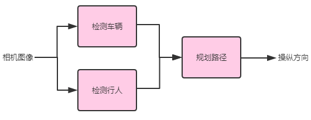

## 发现有缺陷的机器学习流水线

如果你的机器学习流水线的每个单独组件在人类水平性能或接近人类水平性能上执行，但总体流水线性能却远远低于人类水平会怎么样？这通常意味着流水线存在缺陷，需要重新设计。 误差分析还可以帮助你了解是否需要重新设计流水线。

在前一章中，我们提出了这三个部分组件的表现是否达到人类水平的问题。假设所有三个问题的答案都是肯定的，也即是说：

1. 汽车检测部件（大概）是人类级别的性能，用于从摄像机图像中检测汽车。
2. 行人检测组件（大概）是人类级别的性能，用于从摄像机图像中检测行人。
3. 与仅根据前两个流水线组件的输出（而不是访问摄像机图像）规划汽车路径的人相比，路径规划组件的性能处于类似水平。

然而，你的自动驾驶汽车的整体性能远远低于人类水平。即，能够访问摄像机图像的人可以为汽车规划出明显更好的路径。据此你能得出什么结论？

唯一可能的结论是， ML 流水线存在着缺陷。在这种情况下，路径规划组件在给定输出的情况下可以做得很好，但输入没能包含足够的信息。你应该询问自己，除了两个早期流水线组件的输出之外，还需要哪些其他信息来为汽车的驾驶辅助规划路径。换句话说，熟练的人类驾驶员还需要什么其他信息？

例如，假设你意识到人类驾驶员还需要知道车道标记的位置。 这表明你应该按如下方式重新设计流水线：

最后，如果你认为，即使每个组件都具有人类级别的性能（请记住，你要与被给予与组件相同输入的人类进行比较），流水线整体上也不会达到人类水平的性能，则表明流水线有缺陷，应该重新设计。

> 在上面的自动驾驶案例中，理论上可以通过将原始相机图像馈送到路径规划组件中来解决该问题。 但是，这违反了第51章中描述的 “任务简单性” 的设计原则，因为路径规划模块现在需要输入原始图像并且需要解决非常复杂的任务。 这就是添加车道标记检测组件是更好选择的原因 —— 它有助于将重要的和以前缺少的有关车道标记的信息提供给路径规划模块，但可以避免使任何过于复杂而无法构建/训练的特定模块。
