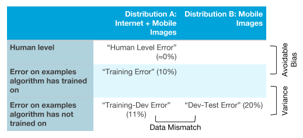

## 辨别偏差、方差和数据不匹配误差

假设在猫咪检测任务中，人类获得了近乎完美的性能（0%误差），因此最优错误率大约为 0%。假设你有：

- 1% 的训练集误差
- 5% 的训练开发集误差
- 5% 的开发集误差

这表明了什么？你知道你有很高的方差。先前章节描述的减少方差的技术应该能使你取得进展。 

现在，假设你的算法达到了：

- 10% 的训练集误差
- 11% 的训练开发集误差
- 12% 的开发集误差

这表明你在训练集上有很高的可避免偏差。该算法在训练集上做得很差，偏差降低技术应该能有所帮助。 

在上面的两个例子中，该算法只存在高可避免偏差或高方差。一个算法有可能同时受到高可避免偏差、高方差和数据不匹配的子集的影响。例如：

- 10% 的训练集误差
- 11% 的训练开发集误差
- 20% 的开发集误差

该算法存在高可避免偏差和数据不匹配问题。然而，它在训练集的分布上并没有很大的差异。 通过将不同类型的误差理解为表中的条目，可能将更容易理解不同类型的误差是如何相互关联的：

继续以猫咪图像检测器为例，你可以看到在 x 轴上有两种不同的数据分布。在 y 轴上，我们有三种类型的误差：人为误差，算法上误差，以及算法未经过训练的样本误差。我们可以用我们在前一章中发现的不同类型的误差来填写表格。

如果你愿意，你也可以在这个表格中填入剩下的两个空格：你可以通过让一些人给你的手机图片数据贴上标签，并测量他们的误差，你可以填写右上角的空格（移动应用图像上的人类水平表现）。你也可以通过移动应用猫的图像（分布B）来填充下一个空格，并将一小部分放入训练集，这样神经网络也可以学习它。 然后在数据的子集上测量学习模型的误差。填充这两个额外的条目可能会让我们对算法在两个不同的分布（分布A和B）上做的事情有更多的了解。 

通过了解算法最容易产生哪些类型的误差，你将能够更好地决定是否聚焦于减少偏差、减少方差或减少数据不匹配的技术。